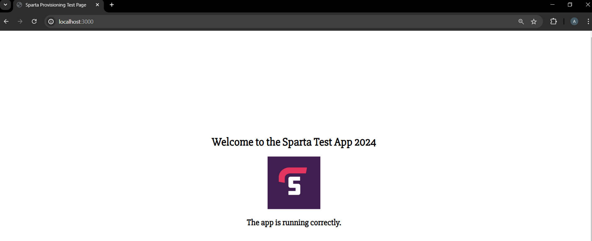

# Project-1-Implement-a-CI-CD-Pipeline

### Create and Set-Up Jenkins Server

1. **Setup an EC2 Instance on AWS**

   - Launch an EC2 instance on AWS.
   - Configure a custom security group with port 8080 open.

2. **SSH into the EC2 Instance**

   - Use a terminal (e.g., Gitbash) to SSH into your EC2 instance.

3. **Install Jenkins**

    ```bash
   sudo apt update -y

   sudo apt upgrade -y

   sudo wget -O /usr/share/keyrings/jenkins-keyring.asc \
     https://pkg.jenkins.io/debian-stable/jenkins.io-2023.key

   echo "deb [signed-by=/usr/share/keyrings/jenkins-keyring.asc]" \
     https://pkg.jenkins.io/debian-stable binary/ | sudo tee \
     /etc/apt/sources.list.d/jenkins.list > /dev/null

   sudo apt-get install jenkins
    ```

4. **Install Java**

   ```bash
   sudo apt update -y
   sudo apt upgrade -y
   sudo apt install fontconfig openjdk-17-jre
   java -version
   ```

5. **Start Jenkins**

   ```bash
   sudo systemctl enable jenkins
   sudo systemctl start jenkins
   ```

6. **Download docker on Jenkins Server**
   ```bash
   # Uninstall conflicting packages
   for pkg in docker.io docker-doc docker-compose docker-compose-v2 podman-docker containerd runc; do sudo apt-get remove $pkg; done

   # Set up Docker's apt repository.
   # Add Docker's official GPG key:
   sudo apt-get update
   sudo apt-get install ca-certificates curl
   sudo install -m 0755 -d /etc/apt/keyrings
   sudo curl -fsSL https://download.docker.com/linux/ubuntu/gpg -o /etc/apt/keyrings/docker.asc
   sudo chmod a+r /etc/apt/keyrings/docker.asc

   # Add the repository to Apt sources:
   echo \
     "deb [arch=$(dpkg --print-architecture) signed-by=/etc/apt/keyrings/docker.asc] https://download.docker.com/linux/ubuntu \
     $(. /etc/os-release && echo "$VERSION_CODENAME") stable" | \
     sudo tee /etc/apt/sources.list.d/docker.list > /dev/null
   sudo apt-get update

   # Install latest version
   sudo apt-get install docker-ce docker-ce-cli containerd.io docker-buildx-plugin docker-compose-plugin

   # 
   # Ensure the Jenkins user has permission to run Docker commands:
   sudo usermod -aG docker jenkins
   sudo systemctl restart jenkins
   ```

7. **Add Jenkins User to Docker Group**
   ```bash
   # Ensure the Jenkins user has permission to run Docker commands:
   sudo usermod -aG docker jenkins
   sudo systemctl restart jenkins
   ```

8. **Install Nodejs**
   ```bash
   curl -fsSL https://deb.nodesource.com/setup_20.x | sudo DEBIAN_FRONTEND=noninteractive -E bash -
   sudo DEBIAN_FRONTEND=noninteractive apt-get install -y nodejs
   ```

9. **Install kubectl**
    ```bash
    # Download the kubectl binary:
    curl -LO "https://dl.k8s.io/release/$(curl -L -s https://dl.k8s.io/release/stable.txt)/bin/linux/amd64/kubectl"

    # Install kubectl
    chmod +x kubectl
    sudo mv kubectl /usr/local/bin/

    # Check the Jenkins user and ensure it has the correc PATH:
    sudo su - jenkins
    echo $PATH

    # Add /usr/local/bin to the PATH if it's not already there:
    sudo su - jenkins
    echo 'export PATH=$PATH:/usr/local/bin' >> ~/.bashrc
    source ~/.bashrc
    ```

## Set up Dockerfile

1. **Create Dockerfile**

   In the app repo create the Dockerfile.

   ```dockerfile
   # syntax=docker/dockerfile:1
    
   FROM node:20-alpine
    
   WORKDIR /app
    
   COPY package*.json ./
    
   COPY . .
    
   RUN npm install
    
   USER node
    
   EXPOSE 3000
    
   CMD node app.js

   ```

2. **Test the Dockerfile**

   - Build the image `docker build -t my-node-app .`
   - Run the container `docker run -p 3000:3000 my-node-app`
   - Navigate to <http://localhost:3000> and confirm it's working.
     
   - Check that the home page and other routes (e.g., /fibonacci/10) work correctly.
     

3. **Tag and push the Docker Image**

   - Tag the Docker image: `docker tag my-node-app:latest hussainajhar32/project-1-sparta-app:latest`
   - Push the Docker Image: `docker push hussainajhar32/project-1-sparta-app:latest`
   - Verify that the Docker image is successfully pushed to Docker Hub.
     

## Kubernetes Deployment and Service Setup

1. **Create Deployment and Service files (and Ingress File for production):**

   - Create `deployment.yaml`, `service.yaml`, and optionally `ingress.yaml` for production.

   - Apply the files to Kubernetes:

   ```bash
   kubectl apply -f deployment.yaml
   kubectl apply -f service.yaml
   # Apply ingress if using
   kubectl apply -f ingress.yaml
   ```

2. **Verify the Deployment:**

   - Verify that pods are running and the service is created: `kubectl get pods`, `kubectl get services`
     
   - Verify the application is running on `localhost:30001`
     

## Configure Jenkins

1. **Configure the webhook on GitHub.**
   - Go onto the github repo
   - Go to settings and click on webhooks
   - Add Jenkins payload url `http://<public-ip>:8080/github-webhook/`

2. **Configure Jenkins**
   - Create user
   - Go to `Manage Jenkins` -> `Settings` -> `Security`
   - Scroll to `Git Host Key Verification Configuration` and set `Host Key Verification Strategy` to `Accept First connection` then click `Save`
   - Install Git, Docker, Docker pipeline, Kubernetes and SSH agent plugins
   - Create the credentials required for your pipeline.
  
3. **Create an item as a pipeline in Jenkins.**
   - In Jenkins server create a new job
   - Select Pipeline
   - Configure appropriately

4. **Add Jenkinsfile as the pipeline script.**

   ```groovy
   pipeline {
       agent any

       environment {
           DOCKER_IMAGE = 'project-1-sparta-app:latest'
           DOCKER_REGISTRY = 'hussainajhar32/project-1-sparta-app'
           DOCKER_REGISTRY_CREDENTIALS = 'dockerhub-credentials'
           GIT_CREDENTIALS = 'github-credentials'
           SSH_AGENT_CREDENTIALS = 'github-ssh-agent'
           KUBERNETES_CREDENTIALS = 'kube-config'
           KUBERNETES_DEPLOYMENT_NAME = 'project-1-sparta-app-deployment'
           KUBERNETES_SERVICE_NAME = 'project-1-sparta-app-svc'
           DEV_BRANCH = 'dev'
           MAIN_BRANCH = 'main'
       }

       stages {
           stage('Checkout') {
               steps {
                   git branch: "${env.DEV_BRANCH}", credentialsId: "${GIT_CREDENTIALS}", url: 'https://github.com/Hussainajhar8/DevOps_training.git'
               }
           }

           stage('Run Tests') {
               steps {
                   dir('Post-Academy-Projects/Project-1-Implement-a-CI-CD-Pipeline/repo/app/') {
                       script {
                           // Replace with your testing commands
                           sh 'npm install'
                           sh 'npm test'
                       }
                   }
               }
           }

           stage('Merge to Main') {
               steps {
                   script {
                       sshagent(['github-ssh-agent']) {
                           sh 'git config --global user.email "hussainajhar8@gmail.com"'
                           sh 'git config --global user.name "hussainajhar8"'
                           sh 'mkdir -p ~/.ssh && chmod 700 ~/.ssh'
                           sh 'ssh-keyscan github.com >> ~/.ssh/known_hosts'
                           sh """
                           git checkout ${MAIN_BRANCH}
                           git merge ${DEV_BRANCH}
                           git push git@github.com:Hussainajhar8/DevOps_training.git ${MAIN_BRANCH}
                           """
                       }
                   } 
               }
           }

           stage('Build Docker Image') {
               steps {
                   dir('Post-Academy-Projects/Project-1-Implement-a-CI-CD-Pipeline/repo/app/') {
                       script {
                           dockerImage = docker.build("${DOCKER_REGISTRY}:${env.BUILD_ID}")
                       }
                   }
               }
           }

           stage('Push Docker Image') {
               steps {
                   dir('Post-Academy-Projects/Project-1-Implement-a-CI-CD-Pipeline/repo/app/') {
                       script {
                           docker.withRegistry('', "${DOCKER_REGISTRY_CREDENTIALS}") {
                               dockerImage.push("${env.BUILD_ID}")
                               dockerImage.push('latest')
                           }
                       }
                   }
               }
           }


           stage('Deploy to Kubernetes') {
               steps {
                   script {
                           sh """
                           mkdir -p ~/.kube
                           echo "$KUBERNETES_CREDENTIALS" > ~/.kube/config
                           """
                           withEnv(["KUBERNETES_CREDENTIALS=~/.kube/config"]) {
                           sh '''
                           kubectl set image deployment/${KUBERNETES_DEPLOYMENT_NAME} ${KUBERNETES_DEPLOYMENT_NAME}=${DOCKER_REGISTRY}:latest
                           kubectl rollout status deployment/${KUBERNETES_DEPLOYMENT_NAME}
                           '''
                       }
                   }
               }
           }
       }

       post {
           always {
               cleanWs()
           }
       }
   }

   ```

5. **Add the credentials for github, docker and kubernetes.**
       - For Github credentials, create `Secret text` and add a personal access token
       - For Dockerhub, click on `Username with password` and add your details
       - For Kubernetes, click on `Secret file` and then upload the file `~/.kube/config`.
       
       - For SSH agent, click on `SSH Username with private key` and then choose a username and enter content of private key. (Make sure public key is on github account)

## Deploy kubernetes on Ubuntu virtual machine

1. **Create VM with Ubuntu 22.04 LTS**:
   - Use Ubuntu 22.04 LTS for the VM image.
   - Create a virtual network (VNet) with CIDR range 10.0.0.0/16 and divide it into public and private subnets (e.g., public subnet: 10.0.0.0/24).
   - Launch the VM in the public subnet.

2. **Network Security Group (NSG)**:
   - Create a Network Security Group (NSG).
   - Allow inbound traffic for SSH (TCP port 22), HTTP (TCP port 80), and custom TCP port 3000, 5000, 6443, 8443.

3. **Configure the VM**:
   - SSH into the VM and run the following commands

```bash
# Update and upgrade system

sudo apt update -y
sudo DEBIAN_FRONTEND=noninteractive apt upgrade -y 

# Install Docker

sudo DEBIAN_FRONTEND=noninteractive apt install docker.io -y
sudo systemctl enable docker
# sudo systemctl status docker
sudo systemctl start docker

# Install Kubernetes

`curl -fsSL https://pkgs.k8s.io/core:/stable:/v1.30/deb/Release.key | sudo gpg --dearmor -o /etc/apt/keyrings/kubernetes-apt-keyring.gpg`
`echo 'deb [signed-by=/etc/apt/keyrings/kubernetes-apt-keyring.gpg] https://pkgs.k8s.io/core:/stable:/v1.30/deb/ /' | sudo tee /etc/apt/sources.list.d/kubernetes.list`
sudo apt update -y
sudo DEBIAN_FRONTEND=noninteractive apt install -y kubeadm=1.30.2-1.1 kubelet=1.30.2-1.1 kubectl=1.30.2-1.1
sudo apt-mark hold kubeadm kubelet kubectl
kubeadm version

# Deploy Kubernetes

## 1. Prepare for Deployment

sudo swapoff -a
sudo sed -i '/ swap / s/^\(.*\)$/#\1/g' /etc/fstab
sudo vim /etc/modules-load.d/containerd.conf

Add the following:
overlay
br_netfilter

sudo modprobe overlay
sudo modprobe br_netfilter
sudo vim /etc/sysctl.d/kubernetes.conf

# Add the following:
net.bridge.bridge-nf-call-ip6tables = 1
net.bridge.bridge-nf-call-iptables = 1
net.ipv4.ip_forward = 1

sudo sysctl --system

## 2. Assign Hostname for Each Server Node

sudo hostnamectl set-hostname master-node # use this command on master node
sudo hostnamectl set-hostname worker01 # use this command on worker node
sudo vim /etc/hosts

# Add the IP and hostname of all nodes.

## 3. Initialize Kubernetes on Master Node

sudo vim /etc/default/kubelet

# Add the following:
KUBELET_EXTRA_ARGS="--cgroup-driver=cgroupfs"

sudo systemctl daemon-reload && sudo systemctl restart kubelet
sudo vim /etc/docker/daemon.json

# Add the following:
{
  "exec-opts": ["native.cgroupdriver=systemd"],
  "log-driver": "json-file",
  "log-opts": {
    "max-size": "100m"
  },
  "storage-driver": "overlay2"
}

sudo systemctl daemon-reload && sudo systemctl restart docker
sudo find / -type f -name "10-kubeadm.conf"
sudo vim /usr/lib/systemd/system/kubelet.service.d/10-kubeadm.conf

# Add the following:
Environment="KUBELET_EXTRA_ARGS=--fail-swap-on=false"

sudo systemctl daemon-reload && sudo systemctl restart kubelet
sudo kubeadm init --control-plane-endpoint=master-node --upload-certs

## Now copy the kubeadm join command for worker nodes

kubeadm join master-node:6443 --token q9bm3v.zwg1fynpljbovs1j \
  --discovery-token-ca-cert-hash sha256:f4d50ca961d78f005782052d15c4663adff1c58b1ffa4a36ce0c0cc18cbc5847

mkdir -p $HOME/.kube
sudo cp -i /etc/kubernetes/admin.conf $HOME/.kube/config
sudo chown $(id -u):$(id -g) $HOME/.kube/config

## 4. Deploy Pod Network to Cluster

kubectl apply -f https://github.com/flannel-io/flannel/releases/latest/download/kube-flannel.yml
kubectl taint nodes --all node-role.kubernetes.io/control-plane-

## 5. Join any worker nodes to Cluster (execute on worker nodes)

sudo systemctl stop apparmor && sudo systemctl disable apparmor
sudo systemctl restart containerd.service
sudo kubeadm join [master-node-ip]:6443 --token [token] --discovery-token-ca-cert-hash sha256:[hash]

## 6. Ensure Jenkins has Correct Permissions
kubectl create clusterrolebinding jenkins-cluster-admin --clusterrole=cluster-admin --user=admin

```

4. **Update Jenkins**:
   - Run `cat $HOME/.kube/config` on the kubernetes master node.
   - Store the contents on a local file.
   - Edit the server to include the private ip of the virutal machine running the master-node instead of the master-node hostname.
     ```bash
     apiVersion: v1
     clusters:
     - cluster:
         certificate-authority-data: <base64-encoded-ca-cert>
         server: https://172.31.28.117:6443
     ```
   - Update the kube-config credential with this file.
   - Add the public IP into the kubeadm config file

     ```bash
     # Generate a Basic Configuration File
     kubeadm config print init-defaults > kubeadm-config.yaml

     # Edit config
     vim kubeadm-config.yaml

     -------------------------------------------------------
     apiVersion: kubeadm.k8s.io/v1beta3
     kind: InitConfiguration
     ---
     apiVersion: kubeadm.k8s.io/v1beta3
     kind: ClusterConfiguration
     apiServer:
     certSANs:
     - "34.243.102.252"  # Add your public IP address here
     -------------------------------------------------------

     # Recreate API Server Certificates
     sudo kubeadm init phase certs apiserver --config=kubeadm-config.yaml
     sudo kubeadm init phase kubeconfig all --config=kubeadm-config.yaml

     # Restart the Control Plane Components
     sudo systemctl restart kubelet

     # Verify the Configuration from the Jenkins machine
     KUBECONFIG=/var/lib/jenkins/.kube/config kubectl get nodes
     ```
   - Ensure DNS Resolution, Update hosts file on Jenkins machine `sudo vim /etc/hosts` and add the following line `<private-ip-of-kubernetes machine`> master-node
`
   - Go to Jenkins Dashboard > Manage Jenkins > Manage Nodes and Clouds > Configure Clouds.
Ensure the Kubernetes cloud configuration has the correct credentials and URL.
